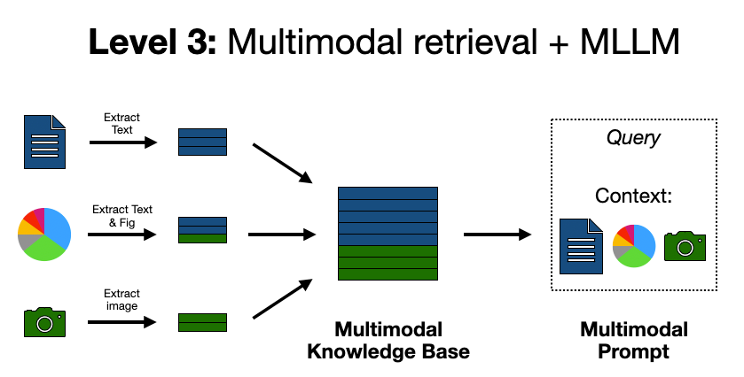

# Multimodal RAG

Question answering over PDFs that actually reads the **figures and tables**, not
just the prose around them.

A plain text RAG pipeline flattens a PDF into strings. Everything a chart shows —
the trend, the axis labels, the value at the peak — is thrown away before the
index is built, and no amount of retrieval tuning gets it back. This project
keeps that information by treating a page as a layout rather than a wall of text.



## How it works

```
PDF ──► extract ──► summarise ──► index ──► retrieve ──► answer
        │           │             │         │            │
        │           │             │         │            └─ figures are re-sent
        │           │             │         │               to the vision model
        │           │             │         └─ returns the full element,
        │           │             │            image path included
        │           │             └─ Chroma (summary vectors)
        │           │                + SQLite (full elements)
        │           └─ a vision model describes each figure and
        │              transcribes each table to Markdown
        └─ text chunks, plus figure/table *regions* rendered to PNG
```

Three ideas do most of the work:

**1. Regions are rendered, not parsed.** Instead of trying to reconstruct table
cells from a PDF's drawing commands — which mangles most real tables — the
extractor locates the rectangle a figure or table occupies and rasterises it.
A vision model then reads the image. On the sample paper this recovered nine
tables that a line-based parser found zero of, because academic tables often
have no ruling lines at all.

**2. Tables are found by their captions.** When there are no rules to detect,
the `Table 4.` caption is the signal. The extractor anchors on it and walks down
the contiguous run of text below, stopping at the first large vertical gap.

**3. Retrieval is multi-vector and hybrid.** What gets embedded is a *summary*
of each element; what gets returned is the full element with its rendered image.
An image has no text to embed, so the model-written description stands in for it
at search time — and the image itself is handed to the answering model
afterwards.

Dense retrieval alone was not enough. "What does Figure 13 show?" reliably
returned Figures 5, 7 and 10, because a sentence encoder sees almost no
difference between one figure caption and another. Two additions fix it:
candidates are re-ranked on verbatim overlap as well as embedding similarity,
and any figure or table the question names outright is looked up by caption and
promoted — re-ranking alone cannot rescue a result dense search never returned.

That last step is why answers can cross-check a chart against the text. On the
sample paper, asking about model rankings produced an answer that noticed
Figure 13 and the surrounding prose *disagreed* — something impossible if the
figure had only ever been a caption string.

## Quick start

```bash
pip install -r requirements.txt
cp .env.example .env          # add your GROQ_API_KEY
```

```bash
python run.py health                      # verify credentials and connectivity
python run.py ingest data/pdfs/paper.pdf  # index a PDF (or a whole directory)
python run.py ask "Which model has the lowest RMSE?"
```

For the web UI, run the API and the frontend in two terminals:

```bash
python run.py serve                       # http://127.0.0.1:8000  (docs at /docs)
cd frontend && npm install && npm run dev  # http://localhost:5173
```

Upload a PDF in the sidebar, wait for ingestion, then ask. Answers cite sources
as `[S1]`, and each cited figure or table is shown beneath the answer as the
actual rendered crop — click to enlarge.

## Requirements

- Python 3.12+
- A **vision-capable** Groq model. Text-only models will silently degrade the
  whole point of the project; `python run.py health` checks this.
- Node 18+ for the frontend.

No system packages are needed. The default extractor is PyMuPDF, which ships as
a self-contained wheel — no poppler, no tesseract.

## Configuration

Everything is environment driven; see [.env.example](.env.example) for the full
list. The settings that matter most:

| Variable | Default | Notes |
| --- | --- | --- |
| `GROQ_MODEL` | `qwen/qwen3.6-27b` | Must accept images. Groq retired the Llama-4 vision models; check [their model list](https://console.groq.com/docs/models) before changing this. |
| `EMBEDDING_PROVIDER` | `local` | `local` runs sentence-transformers in-process: no API key, no rate limit, works offline. `hf_api` calls Hugging Face instead. |
| `EXTRACTOR_BACKEND` | `pymupdf` | Switch to `unstructured` for **scanned** PDFs (needs poppler + tesseract on `PATH`). |
| `RETRIEVAL_K` | `6` | Sources retrieved per question. |
| `LEXICAL_WEIGHT` | `0.35` | Share of ranking from verbatim overlap vs. embedding similarity. `0` disables hybrid retrieval. |
| `MAX_IMAGES_PER_ANSWER` | `2` | Images dominate token cost — see below. |
| `RENDER_DPI` | `200` | Resolution of figure/table crops. |

### Rate limits

The defaults are tuned for Groq's **free tier**, which allows 8000 tokens per
request. Images are the expensive part, so `MAX_IMAGES_PER_ANSWER=2`,
`IMAGE_MAX_DIMENSION=900` and `MAX_CONTEXT_CHARS=6000` keep a typical request
inside that budget. On a paid tier, raise all three for richer answers.

The client handles limits rather than assuming they won't happen:

- **429 with a stated delay** — sleeps for exactly the delay the provider asks
  for, rather than an exponential guess that expires too early.
- **Too many images** — retries with one fewer image instead of failing.
- **Payload too large** — sheds images, then trims context, then retries.
- **401 / 404** — fails immediately; a bad key or a retired model will never
  succeed on retry.

Set `LLM_MIN_REQUEST_INTERVAL` to space out calls during ingestion if you hit
limits often.

## Layout

```
multimodal_rag/
  config.py          pydantic-settings; every knob, validated at startup
  domain.py          Element, RetrievedSource, Answer — no framework imports
  extractors/        pluggable backends
    regions.py       bbox clustering, caption binding, column detection
    pymupdf_backend.py     default; renders figure/table regions to PNG
    unstructured_backend.py opt-in; layout model + OCR for scanned PDFs
  models/            vision chat client, embeddings, prompts
  storage/           Chroma vectors + SQLite element store
  pipeline/          ingest, summarise, query
  api/               FastAPI app, schemas, background jobs
  cli.py
frontend/            Vite + React + TypeScript chat UI
tests/               123 tests, no network required
```

## CLI

```
python run.py health                  # check credentials, models, index size
python run.py ingest <path> [--force] # index a PDF or a directory
python run.py ask ["question"]        # one-shot, or interactive if omitted
python run.py documents               # list what is indexed
python run.py delete <document_id>    # remove a document
python run.py serve [--reload]        # run the HTTP API
```

Ingestion is **idempotent**: the document id is a hash of the file's bytes, so
re-uploading the same PDF skips straight past the expensive vision calls. Use
`--force` to rebuild.

## API

| Method | Path | Purpose |
| --- | --- | --- |
| `GET` | `/api/health` | Config summary and index size |
| `POST` | `/api/documents` | Upload a PDF; returns a job id (202) |
| `GET` | `/api/jobs/{id}` | Poll ingestion progress |
| `GET` | `/api/documents` | List indexed documents |
| `DELETE` | `/api/documents/{id}` | Remove a document |
| `POST` | `/api/chat` | Ask a question; returns the answer and its sources |
| `GET` | `/api/elements/{id}/image` | Rendered crop for a cited figure or table |

Interactive docs at `/docs`. Ingestion runs in the background because a long PDF
costs one vision call per figure; the client polls rather than holding a request
open.

## Development

```bash
pip install -r requirements-dev.txt
pytest                    # 123 tests, offline
ruff check . && ruff format --check .
cd frontend && npm run typecheck && npm run build
```

Tests generate their own fixture PDF (two-column prose, a bar chart, a rule-less
table) and stub the chat model, so the suite needs no API key and no network.

## Known limits

- **Scanned PDFs** need `EXTRACTOR_BACKEND=unstructured` plus poppler and
  tesseract; the default backend reads embedded text and cannot OCR.
- **Figure detection is heuristic.** Charts drawn as loose vector primitives can
  be split or merged; tune `REGION_MERGE_GAP` and `MIN_REGION_AREA_RATIO`.
- **Answer quality is bounded by the vision model.** A small model misreads
  dense tables; the rendered crop is always shown so the user can verify.
- **Switching `EMBEDDING_PROVIDER` invalidates the index** — the vector spaces
  are not compatible. Re-ingest after changing it.
